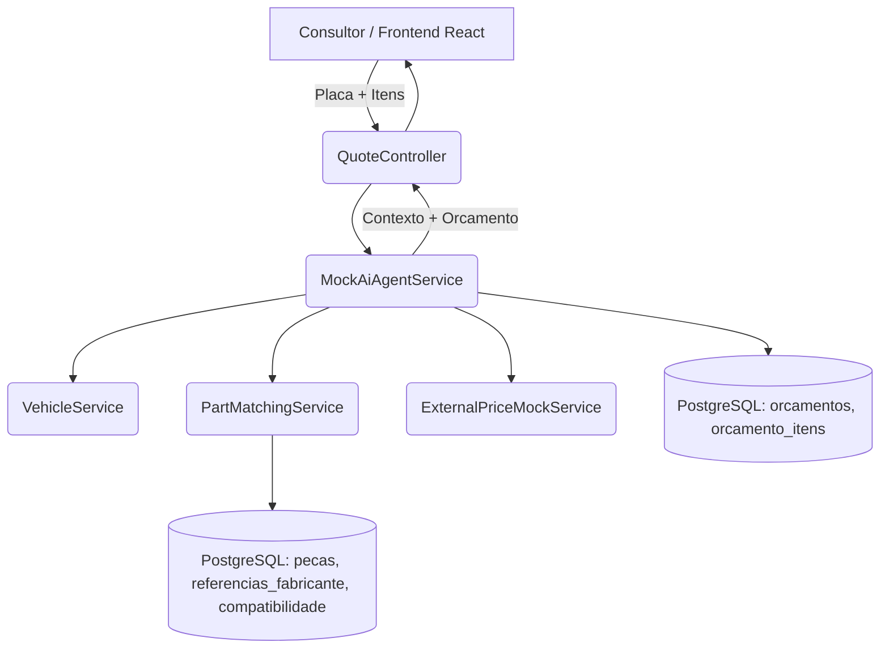

# 🚗 AutoQuote Copilot | Automotive Parts Matcher & AI Quotation Engine

PoC de estudo/portfolio de um sistema real que desenvolvi para automatizar a
identificação de peças por placa veicular e a montagem de orçamentos cotados.
Esta versão pública roda com **dados 100% sintéticos** e com a etapa de
"agente de IA" **simulada** (`MockAiAgentService`), para não depender de
chave de API paga nem de acesso a sistemas internos.

---

## 📌 Contexto e problema original

No sistema real, consultores de pós-venda:
- gastavam tempo cruzando manualmente o modelo do carro com catálogos de
  peças originais (OEM) e de reposição (Aftermarket);
- pesquisavam preços em múltiplos fornecedores externos;
- digitavam o orçamento item a item no sistema de gestão interno.

A solução original resolve isso montando um contexto estruturado
(placa + itens já cruzados com referências) e delegando a um agente de IA
(Claude Code) a tarefa de acessar o sistema de gestão e cotar os preços em
sites parceiros.

## 💡 O que esta versão pública demonstra

- **Matching de peças por texto livre** (`PartMatchingService`): normaliza o
  texto digitado e resolve para a peça do catálogo via sinônimos.
- **Cross-reference de fabricante** (`ManufacturerReference` +
  `Compatibility`): filtra quais códigos OEM/Aftermarket são compatíveis com
  o veículo consultado.
- **Geração de contexto estruturado** (`MockAiAgentService.construirContexto`):
  o mesmo tipo de texto corrido que, no sistema original, é enviado ao agente
  de IA.
- **Orquestração do orçamento**: monta o orçamento final e "cota" preços via
  `ExternalPriceMockService` (mock — sem scraping real).

A parte que na versão real chama a API da Claude / Claude Code foi
substituída por uma regra determinística (`MockAiAgentService`), documentada
no código, para manter o projeto 100% funcional sem custo de API.

---

## 🛠️ Stack

- **Backend:** Java 17, Spring Boot 3 (Web, Data JPA, Validation), Lombok
- **Banco de dados:** PostgreSQL
- **Frontend:** React + Vite
- **Infra:** Docker / Docker Compose

---

## 🏗️ Arquitetura



---

## 📦 Como executar

### Opção 1 — Docker Compose (recomendado)

```bash
docker-compose up --build
```

- Backend: http://localhost:8080
- Frontend: http://localhost:5173
- PostgreSQL: localhost:5432 (usuário/senha/banco: `autoquote`)

### Opção 2 — Rodando localmente

```bash
# Banco de dados
docker run --name autoquote-db -e POSTGRES_DB=autoquote \
  -e POSTGRES_USER=autoquote -e POSTGRES_PASSWORD=autoquote \
  -p 5432:5432 -d postgres:16-alpine

# Backend
cd backend
mvn spring-boot:run

# Frontend (em outro terminal)
cd frontend
npm install
npm run dev
```

Os dados (veículos, peças, referências e compatibilidade) são carregados
automaticamente via `data.sql` na subida da aplicação.

---

## 🔎 Exemplo de uso da API

```bash
curl -X POST http://localhost:8080/api/orcamentos \
  -H "Content-Type: application/json" \
  -d '{
    "placa": "ABC1D23",
    "itens": ["disco de freio dianteiro", "pastilha de freio dianteira"]
  }'
```

Placas cadastradas na PoC: `ABC1D23` (VW Gol 2015), `XYZ2E45` (Chevrolet
Onix 2019), `JJK9B12` (Fiat Argo 2021). Veja mais exemplos em
[`docs/exemplos-api.md`](docs/exemplos-api.md).

---

## 📈 Resultado esperado (no sistema original)

- Redução do tempo de montagem de orçamento de minutos para segundos.
- Menos devoluções por incompatibilidade de peças, graças à padronização
  OEM/Aftermarket.
- Consultor deixa de digitar manualmente e passa a apenas validar o
  orçamento gerado.

---

## 🔒 Nota de compliance e privacidade

Este repositório é uma Prova de Conceito (PoC) técnica e educacional.
Todos os dados de veículos, peças e fornecedores são sintéticos/mockados.
Nenhum dado de cliente, credencial, endpoint interno ou regra de negócio
proprietária da empresa original foi incluído aqui.
