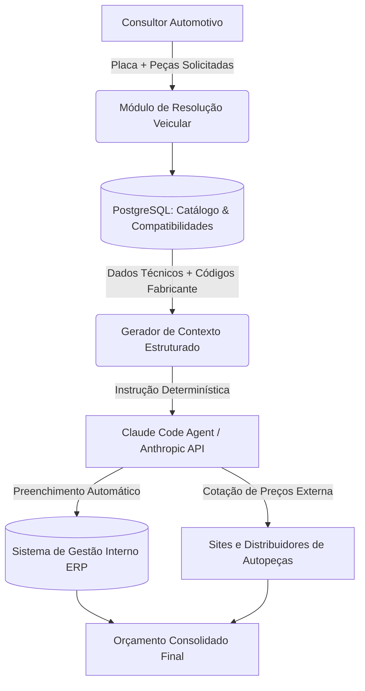

# 🚗 AutoQuote Copilot | Automotive Parts Matcher & AI Quotation Engine

Sistema inteligente para catalogação de peças por placa veicular e automação de orçamentos e cotações, integrando banco de dados relacional e agente autônomo de IA (Claude Code / Anthropic API).

---

## 📌 Visão Geral do Problema

Consultores automotivos enfrentavam gargalos operacionais críticos no atendimento pós-venda:

- **Identificação manual de peças:** cruzar o modelo do carro com catálogos de diferentes montadoras (OEM) e marcas de reposição gerava lentidão e margem para devoluções por incompatibilidade.
- **Cotação fragmentada:** pesquisar preços e disponibilidade manualmente em múltiplos fornecedores externos consumia tempo considerável por veículo.
- **Digitação no sistema de gestão:** cadastrar item por item e montar o orçamento manualmente era repetitivo e suscetível a erros de digitação.

---

## 💡 A Solução

Pipeline integrado que transforma uma entrada simples (placa + lista de peças em linguagem informal) em um orçamento completo e cotado:

1. **Decodificação e cruzamento de peças:** a partir da placa, o sistema consulta as especificações do veículo e mapeia as peças solicitadas para os códigos exatos de montadora (OEM) e de fabricantes de reposição (Aftermarket).
2. **Engenharia de contexto estruturada:** os dados são compilados em um texto corrido, determinístico e padronizado, pronto para ser consumido por um agente de IA sem ambiguidade.
3. **Orquestração com agente autônomo (Claude Code):** o agente recebe o contexto formatado, acessa o sistema de gestão para montar o orçamento e realiza pesquisas em sites externos para cotação de preços.

---

## 🛠️ Tecnologias Utilizadas

- **Agente de IA & Desenvolvimento:** Claude Code CLI, Anthropic Claude API (engenharia de prompts e workflows agentic), VS Code
- **Banco de Dados:** PostgreSQL 16 (modelagem relacional de veículos, compatibilidades e catálogo de peças) com fallback autônomo para SQLite embutido
- **Backend & Resolução:** Node.js (Engine de resolução veicular, NLP automotivo e cotação)
- **Frontend / Dashboard:** Interface web responsiva em Dark Mode com visualização de placa Mercosul e orçamentação em tempo real
- **Infraestrutura:** Docker, Docker Compose, VPS Hostinger (Linux)

---

## 🏗️ Arquitetura do Sistema



---

## ⚙️ Modelagem do Banco de Dados (PostgreSQL)

O banco relacional modela com fidelidade a complexidade do ecossistema automotivo:

- **`veiculos`**: dados de placa/chassi, marca, modelo, ano de fabricação, ano do modelo, motorização e versão.
- **`fabricantes`**: montadoras (OEM) e fabricantes de autopeças (Aftermarket: Bosch, TRW, Fras-le, Nakata, Cofap, Mahle, etc.).
- **`pecas`**: cadastro mestre com código interno, nome genérico, categoria e posição.
- **`referencias_fabricante`**: tabela de cross-reference ligando a peça aos códigos originais de montadora e marcas de reposição.
- **`compatibilidade`**: tabela associativa que relaciona quais versões de veículos aceitam cada peça/referência com notas técnicas.
- **`cotacoes_fornecedores`**: registros de distribuidores com preços de tabela, preços cotados, prazos e estoque para simulação do agente.

---

## 📦 Como Executar o Projeto Localmente (PoC)

### Pré-requisitos

- Node.js (v18+)
- *(Opcional)* Docker e Docker Compose instalados
- *(Opcional)* Claude Code CLI configurado com sua chave de API (`export ANTHROPIC_API_KEY=sua_chave`)

---

### 1. Clonar o repositório

```bash
git clone https://github.com/seu-usuario/autoquote-copilot.git
cd autoquote-copilot
```

---

### 2. Subir o Banco com Docker (PostgreSQL)

O `docker-compose.yml` desta PoC sobe o container do PostgreSQL, automaticamente populado via `db/init.sql`:

```bash
docker-compose up -d
```

> **Nota de Execução Autônoma:** Caso deseje rodar a PoC imediatamente sem Docker ativo, o projeto inclui uma camada de fallback transparente com SQLite (`autoquote.db`). O script de carga pode ser executado com:
> ```bash
> npm run seed
> ```

---

### 3. Exemplo de Uso via CLI

Execute a resolução do veículo e gere o contexto determinístico formatado para o agente:

```bash
node cli.js --placa ABC1D23 --itens "disco de freio dianteiro, pastilha"
```

**Exemplo de saída (contexto gerado para o agente):**

```text
Veículo: Volkswagen Gol 2021/2022 1.0 12V MPI
Item 1: Disco de freio dianteiro ventilado — Ref. OEM: 5U0615301 | Ref. Bosch: 0 986 BB4 043 | Ref. Fras-le: RCDI00870 | Ref. Nakata: NKF 6043
Item 2: Pastilha de freio dianteira — Ref. OEM: 5U0698151A | Ref. Bosch: 0 986 BB0 735 | Ref. Fras-le: PD/58 | Ref. TRW: RCPT02840
Ação solicitada: montar orçamento e cotar os itens acima em fornecedores parceiros.
```

#### Executar simulação de cotação externa e montagem de orçamento via CLI:

```bash
node cli.js --placa ABC1D23 --itens "disco de freio dianteiro, pastilha" --cotar
```

---

### 4. Interface Web / Dashboard Interativo

Inicie o servidor integrado com API REST e Dashboard visual:

```bash
npm start
```

Acesse em seu navegador: **`http://localhost:3000`**

Recursos do Dashboard:
- Input interativo estilo placa Mercosul oficial
- Resolução e telemetria veicular decodificada
- Cards de peças com badges OEM e Aftermarket
- Visualizador com botão "Copiar Contexto" para Claude Code
- Simulador de Cotação com distribuidores parceiros e cálculo financeiro do orçamento da oficina

---

## 🧪 Executando os Testes Automatizados

O projeto inclui uma suíte completa de testes de unidade cobrindo normalização de placas, validação Mercosul, parser de linguagem informal, cross-reference de fornecedores e consolidação de orçamento:

```bash
npm test
```

---

## 📈 Impacto e Resultados

- **Redução do lead time:** o tempo médio para identificação de peças e cotação caiu de minutos para segundos.
- **Menos erros de compatibilidade:** a padronização dos códigos OEM/fabricante reduziu retrabalho e compra de peça errada.
- **Automação operacional:** o consultor deixa de digitar manualmente e passa a apenas validar e aprovar o orçamento final.

---

## 🔒 Nota de Compliance e Privacidade

Este repositório é uma Prova de Conceito (PoC) técnica e educacional. Todos os dados de clientes, acessos a sistemas proprietários internos e chaves de API foram sanitizados e substituídos por dados sintéticos/mockados, em conformidade com boas práticas de segurança e sigilo de dados.
