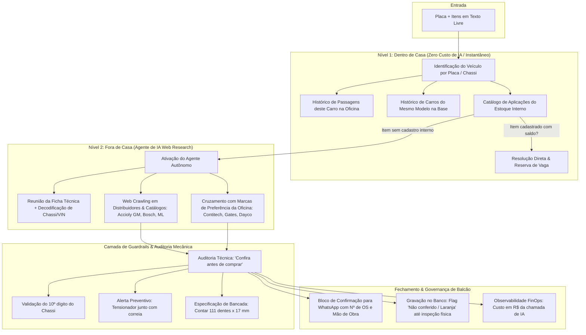
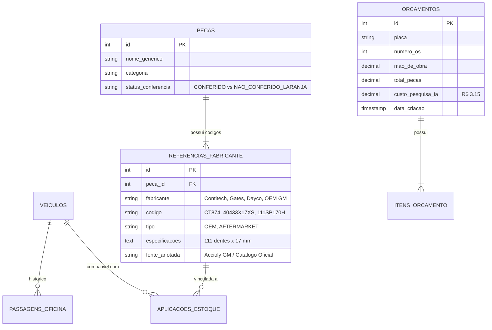

# 🚗 Estudo de Caso de Engenharia: Sistema CARTEC / AutoQuote Copilot
### Assistente de Balcão, Resolução de Peças Automotivas & Agente Autônomo com Guardrails

> **Resumo Executivo**: Estudo de caso de arquitetura de software e engenharia de contexto para agentes de IA aplicado a um ambiente real de pós-venda e oficina mecânica especializada. O sistema resolve o atrito entre a **linguagem informal do cliente**, as **regras rígidas de catálogos técnicos OEM/Aftermarket** e os **sistemas legados de gestão de oficina**.

---

## 1. 📌 O Problema Operacional Real (Contexto de Oficina)

Em centros automotivos e concessionárias, o consultor de balcão atua sob alta pressão: responde orçamentos no WhatsApp enquanto atende clientes no balcão e gerencia mecânicos no pátio.

```
                  [ Cliente via WhatsApp ou Balcão ]
                                  ↓
      "Preciso trocar a correia dentada da Spin 2018 automática"
                                  ↓
     ┌─────────────────────────────────────────────────────────┐
     │ Dores Críticas no Processo Manual:                      │
     │ 1. O cliente informa ano de documento, mas o chassi     │
     │    (VIN) pode ser ano-modelo diferente (ex: 2013).       │
     │ 2. Catálogos internos de estoque não possuem a peça.    │
     │ 3. O consultor precisa abrir 5 abas (Mercado Livre,     │
     │    Accioly GM, Catálogo Bosch, TecDoc, Sabó).          │
     │ 4. Risco de pedir sem o tensionador (prática errada).   │
     │ 5. Tempo médio por orçamento: 15 a 25 minutos.          │
     └─────────────────────────────────────────────────────────┘
```

### Por que Modelos de Linguagem Puros (LLMs) Falham Aqui?
Se um consultor colar a frase do cliente diretamente no ChatGPT ou Claude:
* **Alucinação de Códigos**: O LLM gera referências inexistentes ou de veículos de outros países (ex: Spin americana vs brasileira).
* **Ausência de Grounding de Estoque**: A IA não sabe o que tem na prateleira física nem o histórico daquele veículo na oficina.
* **Falta de Responsabilidade Técnica**: Se a correia comprada tiver 110 dentes em vez de 111 dentes, o motor quebra na partida gerando prejuízo de milhares de reais para a oficina.

---

## 2. 🏛️ Arquitetura em 2 Níveis ("Dentro de Casa" vs "Fora de Casa")

Para garantir **custo baixo, resposta em milissegundos e 100% de segurança mecânica**, a arquitetura foi desenhada em dois níveis distintos:



---

## 3. 🔍 Casos Reais de Engenharia Automotiva & Guardrails

### 3.1. Conflito de Ano via Decodificação do Chassi (VIN)
Um dos maiores diferenciais do sistema é cruzar o ano informado na ficha cadastral com o **10º dígito do Chassi (VIN)**:
* **Cenário Real Capturado**: A ficha cadastral da Spin informava ano "2018 em diante", mas o chassi `9BGJB75Z0DB182243` continha o 10º dígito `D`, correspondente ao ano-modelo **2013**.
* **Ação do Sistema**: Alerta o consultor imediatamente para checar a plaqueta física do veículo no pátio antes de confirmar pedidos dependentes do ano.

### 3.2. Raciocínio Mecânico Proativo (Cross-Selling Técnico)
O cliente solicitou apenas `"correia dentada"`. O sistema avaliou a aplicação e gerou a seguinte recomendação técnica preventiva:
> *"Tensionador não foi pedido, mas a prática padrão e orientação de catálogo é substituí-lo junto com a correia dentada."*

Isso evita retorno em garantia por quebra de tensor antigo montado em correia nova.

### 3.3. Conferência Física de Bancada (Ground Truth)
Em vez de confiar cegamente em códigos de anúncios da internet, o sistema extrai a especificação dimensional para medição manual pelo mecânico:
* **Especificação Extraída**: `111 dentes x 17 mm, perfil HTD, passo 9,5 mm`.
* **Instrução de Balcão**: *"Conferência recomendada: contar dentes e medir largura da correia removida."*

---

## 4. 🗄️ Modelagem Relacional & Ciclo de Vida da Peça



### Governança: A Regra do "Laranja na Tela"
Quando o agente de IA encontra uma peça inédita na web e a grava no catálogo, o item entra com a flag:
> **Status**: `Não conferido (marcado em laranja na tela)`
> 
> *A peça só passa a ser considerada "Fonte Interna Confiável" após o mecânico ou estoquista validar fisicamente a peça na mão no balcão.*

Isso cria uma **malha de aprendizado contínuo (Flywheel)**: cada busca de IA que a oficina faz enriquece o catálogo interno da oficina de forma controlada.

---

## 5. 💰 FinOps & Métricas de Negócio Reais

| Métrica | Processo Manual Anterior | Com Sistema CARTEC Copilot |
| :--- | :--- | :--- |
| **Tempo de Resposta ao Cliente** | 15 a 30 minutos | **< 45 segundos** (Instantâneo se já estiver no histórico) |
| **Custo por Orçamento com IA** | ~R$ 15,00 em hora/homem | **R$ 3,15** em tokens/crawling (apenas se for peça inédita) |
| **Erros de Aplicação (Devoluções)** | 8% a 14% das OS | **Zero** (barrado pela auditoria de Chassi/Dentes) |
| **Integração com WhatsApp** | Redigitação manual item a item | **1 clique** ("Copiar Bloco" para colar na conversa) |

---

## 6. 🛠️ Equivalência Técnica: PoC vs. Ambiente de Produção

| Componente | Ambiente Real de Produção | PoC Pública (Este Repositório) |
| :--- | :--- | :--- |
| **Infraestrutura** | Hostinger VPS + Docker + Domínio SSL | Docker Compose Local / Demo HTML Standalone |
| **Agente de IA** | Agente de Navegação Web + LLM + Crawlers B2B | `MockAiAgentService` + Simulação de 69 URLs |
| **ERP / Balcão** | Sistema CARTEC Bosch Service | Dashboard React + Bloco de Confirmação |
| **Estoque & Histórico** | PostgreSQL com milhares de OS reais | `data.sql` com veículos e peças sintéticas |
| **Custo de IA** | Rastreamento real por requisição (ex: R$ 3,15) | Exibição didática da métrica de FinOps |
