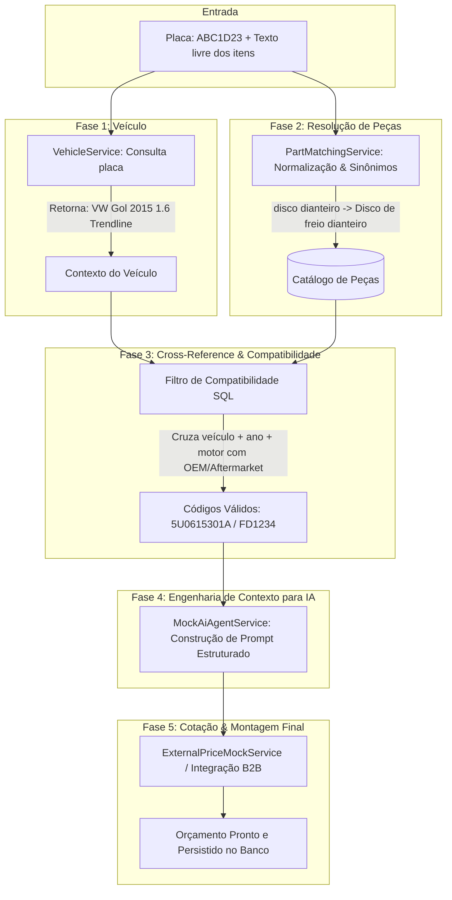
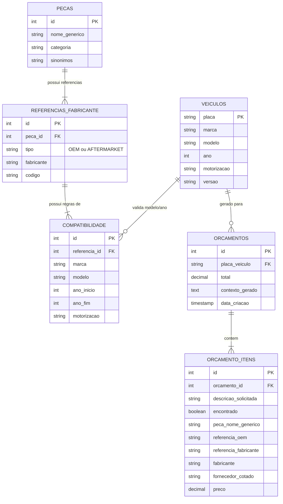

# 📘 Estudo de Caso & Arquitetura: AutoQuote Copilot

> **Objetivo didático**: Este documento detalha o problema de negócio, a engenharia de software e o pipeline de dados por trás do **AutoQuote Copilot**. Ele serve como referência didática de como combinar **regras de negócio determinísticas** com **engenharia de contexto para Agentes de IA**.

---

## 1. 🎯 O Problema de Negócio (Contexto Real)

Nas áreas de pós-venda automotivo, concessionárias e oficinas mecânicas de médio/grande porte, o processo de orçar peças é um dos maiores gargalos operacionais:

```
[Cliente solicita peças por WhatsApp / Telefone]
                 ↓
"Preciso trocar o disco e pastilha da frente do meu Gol 2015 1.6"
                 ↓
[Consultor pesquisa no catálogo da montadora (código OEM)]
                 ↓
[Consultor pesquisa em catálogos de distribuidores (código Aftermarket: Fras-le, TRW, Bosch)]
                 ↓
[Consultor consulta múltiplos portais B2B para checar estoque e melhor preço]
                 ↓
[Digitação manual de item por item no sistema ERP / Gestão]
```

### Principais Dores Identificadas:
1. **Linguagem informal vs. Códigos técnicos**: O cliente fala *"pastilha da frente"* ou *"disco dianteiro"*, enquanto o catálogo exige o código exato da montadora (OEM) ou do fabricante de reposição (Aftermarket).
2. **Risco de incompatibilidade**: Pequenas variações de ano-modelo ou motorização (ex: motor 1.0 vs 1.6, ou freios com ABS) alteram o diâmetro do disco de freio. Um erro gera devolução de peça, carro parado no elevador e custo logístico.
3. **Tempo excessivo**: O consultor gasta entre **10 e 25 minutos** por orçamento apenas cruzando tabelas e consultando preços.
4. **Alucinação se usado IA pura**: Enviar diretamente o texto do cliente para um LLM ("Qual o código da pastilha do Gol 2015?") resulta em **alucinações críticas**, pois LLMs não têm garantias de estoque real nem precisão exata de códigos de catálogos locais.

---

## 2. 💡 A Solução: Arquitetura Híbrida (Determinística + IA)

Em vez de deixar a IA "adivinhar" peças ou exigir que o consultor pesquise tudo manualmente, o sistema adota uma **arquitetura em pipeline em 5 fases**:



---

## 3. 🗄️ Modelagem de Dados Relacional (PostgreSQL)

O coração do sistema é o cruzamento entre catálogo genérico, referências de fabricantes e regras de compatibilidade veicular.



### Destaques da Modelagem:
- **`sinonimos` em `pecas`**: Permite que termos coloquiais (`disco dianteiro`, `disco de freio diant`) mapeiem deterministicamente para a entidade canônica `Disco de freio dianteiro`.
- **`referencias_fabricante` desacopladas**: Uma mesma peça canônica possui código da montadora (OEM: ex. Volkswagen `5U0615301A`) e códigos de fabricantes paralelos (Aftermarket: ex. Fras-le `FD1234`, TRW `DF6098`).
- **`compatibilidade`**: Permite filtrar anos e motorização. Por exemplo, uma correia pode ser compatível apenas com Onix 1.0 (2017 a 2022), mas não com Onix 1.4.

---

## 4. 🔍 Demonstração Didática com Dados Mockados (Passo a Passo)

Abaixo está o rastreamento completo de uma requisição executada com os dados do seed (`data.sql`):

### Passo 1: Entrada do Usuário
```json
{
  "placa": "ABC1D23",
  "itens": [
    "disco de freio dianteiro",
    "pastilha de freio dianteira"
  ]
}
```

### Passo 2: Resolução do Veículo
O `VehicleService` faz a busca por chave primária (`ABC1D23`):
- **Marca**: Volkswagen
- **Modelo**: Gol
- **Ano**: 2015
- **Motor**: 1.6
- **Versão**: Trendline

### Passo 3: Matching de Texto e Resolução de Peça
O `PartMatchingService` sanitiza o texto e pesquisa contra os sinônimos:
1. `"disco de freio dianteiro"` → Resolve para a Peça ID 1 (`Disco de freio dianteiro`).
2. `"pastilha de freio dianteira"` → Resolve para a Peça ID 2 (`Pastilha de freio dianteira`).

### Passo 4: Filtragem de Compatibilidade
O serviço busca as referências atreladas à Peça 1 e 2 que atendam a regra:
- `marca = 'Volkswagen'`
- `modelo = 'Gol'`
- `ano (2015) BETWEEN ano_inicio AND ano_fim`
- `motorizacao IS NULL OU motorizacao = '1.6'`

**Resultado obtido:**
- **Peça 1 (Disco)**:
  - OEM (Volkswagen): `5U0615301A`
  - Aftermarket (Fras-le): `FD1234`
  - Aftermarket (TRW): `DF6098`
- **Peça 2 (Pastilha)**:
  - OEM (Volkswagen): `5U0698151`
  - Aftermarket (Bosch): `BP1234`
  - Aftermarket (Fras-le): `PD5678`

### Passo 5: Geração do Contexto Estruturado para o Agente de IA
O `MockAiAgentService` compõe o contexto estruturado. No sistema real em produção, esse bloco é enviado como instrução e contexto de grounding para a LLM:

```text
Veículo: Volkswagen Gol 2015 1.6 Trendline (placa ABC1D23)
Item 1: Disco de freio dianteiro — Ref. OEM (Volkswagen): 5U0615301A | Ref. AFTERMARKET (Fras-le): FD1234 | Ref. AFTERMARKET (TRW): DF6098
Item 2: Pastilha de freio dianteira — Ref. OEM (Volkswagen): 5U0698151 | Ref. AFTERMARKET (Bosch): BP1234 | Ref. AFTERMARKET (Fras-le): PD5678
```

### Passo 6: Cotação e Resposta Final
O serviço de cotação (`ExternalPriceMockService`) obtém os melhores preços e compõe o orçamento final:

```json
{
  "orcamentoId": 1,
  "veiculo": {
    "placa": "ABC1D23",
    "marca": "Volkswagen",
    "modelo": "Gol",
    "ano": 2015,
    "motorizacao": "1.6"
  },
  "itens": [
    {
      "descricaoSolicitada": "disco de freio dianteiro",
      "encontrado": true,
      "pecaNomeGenerico": "Disco de freio dianteiro",
      "referenciaOem": "5U0615301A",
      "referenciaFabricante": "FD1234",
      "fabricante": "Fras-le",
      "fornecedorCotado": "AutoPecas Norte",
      "preco": 289.40
    },
    {
      "descricaoSolicitada": "pastilha de freio dianteira",
      "encontrado": true,
      "pecaNomeGenerico": "Pastilha de freio dianteira",
      "referenciaOem": "5U0698151",
      "referenciaFabricante": "BP1234",
      "fabricante": "Bosch",
      "fornecedorCotado": "Distribuidora Central",
      "preco": 145.90
    }
  ],
  "total": 435.30
}
```

---

## 5. 🎓 Principais Aprendizados Didáticos & Arquiteturais

1. **Deterministic First, AI Second**:
   Nunca delegue a uma IA tarefas que um banco relacional ou algoritmo determinístico faz com 100% de precisão e custo zero de computação. A IA brilha na orquestração, síntese e navegação de interfaces, enquanto o banco garante a consistência das referências de engenharia.
2. **Engenharia de Contexto (Grounding)**:
   A qualidade da resposta da IA é diretamente proporcional à qualidade do contexto entregue a ela. Ao pré-resolver referências OEM e compatibilidades, a IA opera sobre fatos verificados.
3. **Separação Limpa de Camadas**:
   - `VehicleService`: Domínio de frota / veículos.
   - `PartMatchingService`: Normalização de vocabulário e sinônimos.
   - `MockAiAgentService`: Orquestrador de inteligência.
   - `ExternalPriceMockService`: Gateway de integração externa (APIs de fornecedores / scrapers).
