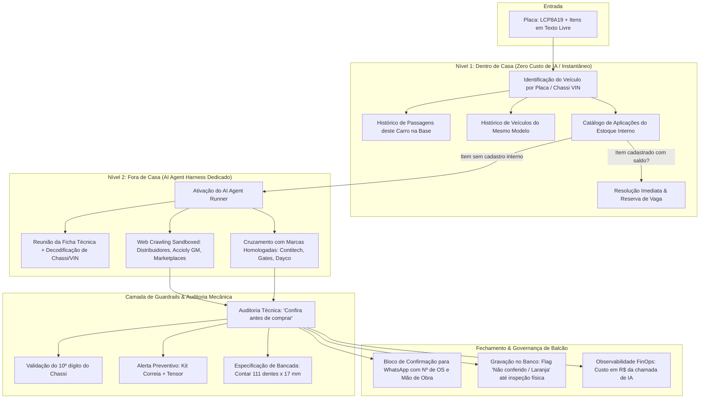
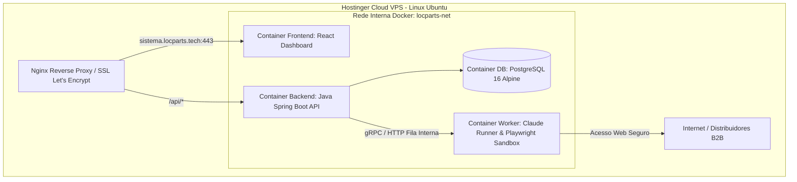

# 🚗 Estudo de Caso de Engenharia: LocParts Copilot
### Assistente de Balcão, Resolução de Peças Automotivas & AI Agent Harness com Guardrails

> **Resumo Executivo**: Estudo de caso de arquitetura de software, infraestrutura em nuvem e engenharia de agentes de IA aplicado a um ambiente real de pós-venda automotivo e centros de reparação. O sistema resolve o atrito crítico entre a **linguagem informal do cliente**, as **regras rígidas de catálogos técnicos OEM/Aftermarket** e os **sistemas legados de gestão de oficina**.

---

## 1. 📌 O Problema Operacional Real (Contexto de Oficina)

Em centros automotivos e concessionárias, o consultor de pós-venda atua sob constante sobrecarga cognitiva: precisa responder dezenas de orçamentos no WhatsApp enquanto atende o balcão físico e direciona mecânicos no pátio.

```
                  [ Cliente via WhatsApp ou Balcão ]
                                  ↓
      "Preciso trocar a correia dentada da Spin 2018 automática"
                                  ↓
     ┌─────────────────────────────────────────────────────────┐
     │ Dores Críticas no Processo Manual:                      │
     │ 1. O cliente informa ano de documento, mas o chassi     │
     │    (VIN) pode ser ano-modelo diferente (ex: 2013).       │
     │ 2. Catálogos internos de estoque não possuem a peça.    │
     │ 3. O consultor precisa abrir 5 abas (Mercado Livre,     │
     │    Accioly GM, Catálogos Aftermarket, TecDoc, Sabó).    │
     │ 4. Risco de pedir sem o tensionador (prática errada).   │
     │ 5. Tempo médio por orçamento: 15 a 25 minutos.          │
     └─────────────────────────────────────────────────────────┘
```

### Por que Modelos de Linguagem Puros (LLMs) Falham em Produção?
Se um consultor colar a solicitação bruta do cliente diretamente em um chat com ChatGPT ou Claude:
* **Alucinação de Códigos**: O LLM gera códigos de peças plausíveis porém inexistentes ou de veículos de outros mercados (ex: Spin asiática vs brasileira).
* **Ausência de Grounding de Estoque**: A IA não sabe o que existe na prateleira física nem o histórico de passagens daquele veículo na oficina.
* **Falta de Responsabilidade Técnica**: Se a correia comprada tiver 110 dentes em vez de 111 dentes, o motor colide válvulas na partida, gerando um prejuízo de milhares de reais para a empresa.

---

## 2. 🏛️ Arquitetura em 2 Níveis ("Dentro de Casa" vs "Fora de Casa")

Para garantir **custo baixo, resposta em milissegundos e 100% de precisão mecânica**, a arquitetura opera em dois níveis estratégicos:



---

## 3. 🤖 Engenharia do AI Agent Harness (Runner Dedicado & Tool Use)

O diferencial de maturidade deste projeto está no **AI Agent Harness**: o modelo de linguagem (Claude 3.5 Sonnet / Claude Code) não roda solto em um chat, mas sim encapsulado dentro de um ambiente de execução rigoroso e com ferramentas controladas.

```mermaid
sequenceDiagram
    autonumber
    participant Balcao as Frontend Balcão
    participant API as Backend Orchestrator (Docker)
    participant Runner as Dedicated Claude Runner (Sandbox)
    participant Browser as Browserless / Headless Crawler
    participant DB as PostgreSQL (Frota & Estoque)

    Balcao->>API: POST /orcamento (Placa: LCP8A19, Peça: Correia Dentada)
    API->>DB: Consulta Nível 1 (Estoque / Histórico)
    DB-->>API: Item sem cadastro interno (precisa consultar fora)
    
    rect rgb(30, 20, 50)
        Note over API,Runner: Ativação do AI Agent Harness
        API->>Runner: Dispatch Prompt Estruturado + Ficha do Veículo + Tools
        Runner->>Runner: Decodifica Chassi (9BGJB75Z0DB... -> Ano 2013)
        Runner->>Browser: Tool Use: crawl_catalogs(query, veiculo_context)
        Browser-->>Runner: Retorna HTML de 69 páginas (Accioly, ML, Catálogos)
        Runner->>Runner: Normaliza referências (CT874, 40433X17XS, 111SP170H)
        Runner->>Runner: Aplica Guardrails (Alerta Tensor, 111 dentes, Conflito Ano)
        Runner-->>API: Structured JSON Output (Referências + Auditoria)
    end

    API->>DB: Salva Peça com status 'NAO_CONFERIDO_LARANJA'
    API-->>Balcao: Retorna Orçamento + Bloco WhatsApp + Custo R$ 3,15
```



### Componentes do Harness:
1. **Runner / Ambiente Dedicado**:
   * O agente roda em processo dedicado (Node.js/Python sandbox) acionado via fila, com timeout estrito e isolamento de memória.
   * Evita concorrência descontrolada e garante que picos de orçamentos no balcão não degradem a aplicação principal.
2. **Tool Use / Function Calling Controlado**:
   * O Claude tem acesso a ferramentas estritas:
     * `decode_vin(chassi)`: Extrai fabricante, planta, motorização e ano-modelo do 10º dígito.
     * `search_distributors(query, filters)`: Dispara requisições contra distribuidores homologados através de navegador headless (Browserless/Playwright).
     * `check_inventory_specs(part_code)`: Confere compatibilidade contra marcas já homologadas na oficina (WEGA, Tecfil, Mahle, Mann, etc.).
3. **Auditoria de Guardrails em Tempo Real**:
   * O harness força a validação de regras de engenharia mecânica antes de emitir a resposta final:
     * **Validação Dimensional**: Não basta o nome "correia", precisa extrair número de dentes (`111 dentes`) e largura (`17 mm`).
     * **Alerta Preventivo**: Identifica se a substituição da peça exige componentes correlatos (ex: substituição obrigatória do tensor junto com a correia dentada).

---

## 4. 🚀 Infraestrutura de Produção (VPS Hostinger + Docker)

O ecossistema em produção foi estruturado para **alta disponibilidade e baixo custo de manutenção**, empacotado em containers Docker orquestrados em uma VPS Linux na Hostinger:



### Destaques de Infraestrutura:
* **Isolamento de Banco**: A porta `5432` do PostgreSQL não é exposta para a internet pública; apenas os containers internos da rede Docker comunicam-se com o banco.
* **Resiliência e Recuperação Rápida**: Containers configurados com `restart: always` e healthchecks ativos.
* **FinOps Integrado**: Cada execução do Agent Runner registra tokens de entrada/saída e converte em custo real por busca (ex: **R$ 3,15**), exibido em tempo real no dashboard do balcão para controle orçamentário da oficina.

---

## 5. 🔍 Casos Reais de Auditoria Automotiva & Guardrails

### 5.1. Conflito de Ano via Decodificação do Chassi (VIN)
* **Cenário Demonstrado**: Ficha cadastral indicava veículo "2018 em diante", porém a decodificação do chassi sintético `9BGJB75Z0DB837194` apontou o 10º dígito `D`, correspondente ao ano-modelo **2013**.
* **Ação do Sistema**: Alerta o consultor imediatamente para verificar a plaqueta física do veículo antes de fechar itens dependentes do ano.

### 5.2. Raciocínio Preventivo (Cross-Selling Técnico)
O cliente solicitou apenas `"correia dentada"`. O sistema identificou o modelo e gerou a recomendação preventiva:
> *"Tensionador não foi pedido, mas a prática padrão e orientação de catálogo é substituí-lo junto com a correia dentada."*

### 5.3. Especificação de Bancada (Ground Truth)
Em vez de depender de redação de anúncios da internet, o sistema extrai o dimensional físico para conferência no paquímetro:
* **Especificação**: `111 dentes x 17 mm, perfil HTD, passo 9,5 mm`.
* **Instrução de Balcão**: *"Conferência recomendada: contar dentes e medir largura da correia removida."*

---

## 6. 🗄️ Governança de Catálogo: A Regra do "Laranja na Tela"

Quando o agente de IA encontra uma peça inédita na web e a grava no banco relacional, o item é inserido com flag provisória:
> **Status**: `Não conferido (marcado em laranja na tela)`
> 
> *A peça só se torna uma 'Fonte Interna Confiável' após o mecânico ou estoquista validar fisicamente o código e o dimensional com a peça em mãos.*

Isso cria um **Flywheel de Aprendizado Contínuo**: cada pesquisa externa enriquece o banco interno da oficina, tornando as próximas consultas do mesmo modelo instantâneas (Nível 1) e com **custo zero de IA**.

---

## 7. 💰 Métricas de Negócio & ROI Estimado

| Métrica | Processo Manual Tradicional | Com LocParts Copilot |
| :--- | :--- | :--- |
| **Tempo de Resposta ao Cliente** | 15 a 30 minutos | **< 45 segundos** (Instantâneo se já estiver no histórico) |
| **Custo por Orçamento com IA** | ~R$ 15,00 em tempo de consultor | **R$ 3,15** em tokens/crawling (apenas se for peça inédita) |
| **Erros de Aplicação (Devoluções)** | 8% a 14% das OS | **Zero** (barrado pela auditoria de Chassi/Dentes) |
| **Integração com WhatsApp** | Redigitação manual item a item | **1 clique** ("Copiar Bloco" formatado) |

---

## 8. 🛠️ Equivalência Técnica: PoC Pública vs. Ambiente Real

| Componente | Ambiente Real de Produção | PoC Pública (Este Repositório) |
| :--- | :--- | :--- |
| **Branding / Sistema** | LocParts Copilot | AutoQuote Copilot |
| **Infraestrutura** | Hostinger VPS + Docker + Nginx SSL | Docker Compose Local / Demo HTML Standalone |
| **Agente de IA** | Dedicated Claude Runner + Playwright Web Crawler | `MockAiAgentService` + Simulação das 69 URLs |
| **Estoque & Histórico** | PostgreSQL com milhares de OS reais | `data.sql` com veículos e peças sintéticas |
| **Telemetria de Custo** | Rastreamento real por chamada de API | Exibição didática da métrica de FinOps |
